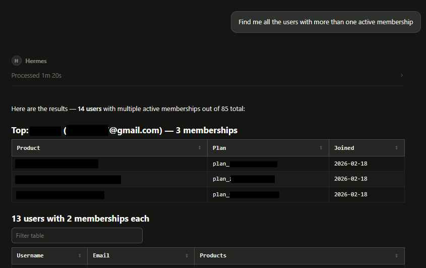

# whop-agent-skill

### Agent skill for interacting with Whop API

Currently only contains read-only actions, such as retrieving member data.

No write actions are implemented currently.

Created for Hermes Agent.

### Example in Hermes Agent:

